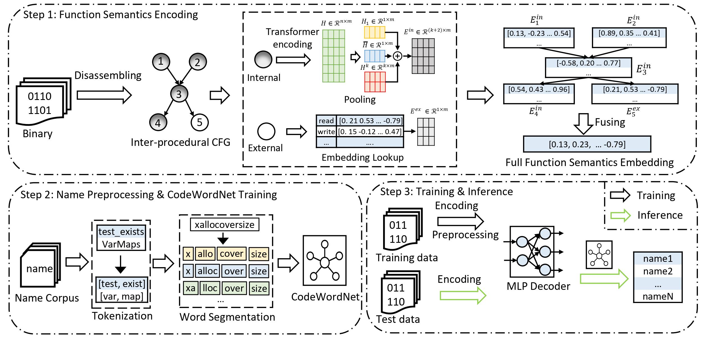

# SymLM

SymLM is a framework for predicting function names in stripped binaries through context-sensitive execution-aware code embeddings. It is a novel neural architecture that learns the comprehensive function semantics by jointly modeling the execution behaviors of the calling context and instructions via a novel fusing encoder. The workflow of SymLM is shown in the image below:

<p align="center"></p>

We implemented SymLM using [Ghidra](https://ghidra-sre.org/) (for binary parsing and ICFG construction), the open source microtrace-based pretrained model from [Trex](https://arxiv.org/abs/2012.08680) (for transformer encoding), [NLTK](https://www.nltk.org/) and [SentencePiece](https://github.com/google/sentencepiece) (for function name preprocessing), and [Gensim](https://radimrehurek.com/gensim/models/word2vec.html) (for CodeWordNet). We built the other components of SymLM with [Pytorch](https://pytorch.org/) and [fairseq](https://github.com/facebookresearch/fairseq). For more details, please refer to our [paper](https://xinjin95.github.io/assets/pdf/SymLM_ccs2022_paper.pdf).

## Table of contents

- [SymLM](#symlm)
  - [Table of contents](#table-of-contents)
  - [Installation](#installation)
    - [Optional Packages](#optional-packages)
  - [Dataset](#dataset)
  - [Model Training](#model-training)
    - [Setup](#setup)
    - [Training](#training)
  - [Prediction and Evaluation](#prediction-and-evaluation)
    - [Function Name Prediction](#function-name-prediction)
    - [Evaluation](#evaluation)
  - [CodeWordNet](#codewordnet)
  - [Citation](#citation)
  - [Troubleshooting](#troubleshooting)

## Installation

To setup the environment, we suggest to use `conda` to install all necessary packages. Conda installation instructions can be found [here](https://docs.conda.io/projects/conda/en/latest/user-guide/install/linux.html). The following setup assumes Conda is installed and is running on Linux system (though Windows should work too).

First, create the conda environment,

`conda create -n symlm python=3.8 numpy scipy scikit-learn`

and activate the conda environment:

`conda activate symlm`

Then, install the latest Pytorch (assume you have GPU and CUDA installed -- check CUDA version by `nvcc -V`. Assume that you have CUDA 11.3 installed. Then you can install pytorch with the following command:

`conda install pytorch torchvision torchaudio cudatoolkit=11.3 -c pytorch -c nvidia`

If CUDA toolkit hasn't been install in your environment, refer to [CUDA toolkit archive](https://developer.nvidia.com/cuda-toolkit-archive) for installation instruction. Then the pytorch installation commands for the specific CUDA version can be found [here](https://pytorch.org/get-started/locally/)).

Next, clone the SymLM and enter and install it via:

```bash
git clone git@github.com:OSUSecLab/SymLM.git
cd SymLM
pip install --editable .
```

Finally, install remaining packages:

`pip install -r requirements.txt`

### Optional Packages

For efficient processing of large datasets, please install PyArrow: 

`pip install pyarrow`

For faster training install NVIDIA's apex library:

``` bash
git clone https://github.com/NVIDIA/apex
cd apex
pip install -v --no-cache-dir --global-option="--cpp_ext" --global-option="--cuda_ext" \
  --global-option="--deprecated_fused_adam" --global-option="--xentropy" \
  --global-option="--fast_multihead_attn" ./
```

## Dataset

We provide a sample `x64` dataset under the [`dataset_generation/dataset_sample`](dataset_generation/dataset_sample) directory and its binarization result under the[`data_bin`](data_bin) directory.

For more details on how these datasets are generated from binaries, please refer to the README under [`dataset_generation/`](dataset_generation/).

## Model Training

### Setup

To train the model, please first download the [pretrained model](https://drive.google.com/file/d/1QsxoRSSVlDDidasTu4GRfNRQNwjJiqcD/view?usp=sharing) and put it under the [checkpoints/pretrained](checkpoints/pretrained) directory. The pretrained model was obtained from [Trex](https://arxiv.org/abs/2012.08680) in Deceber 2021. For the most recent ones, please refer to this [repo](https://github.com/CUMLSec/trex). While the authors of Trex keep updating the pretrained model, there could be imcompatibility issues between our current implementation and the latest pretrained model.

### Training

The script for training the model is [`training_evaluation/train.sh`][training_evaluation/train.sh], in which you have to set the following parameters:

```bash
CHECKPOINT_PATH=checkpoints/train   # path to save checkpoints
TOTAL_UPDATES=20000    # Total number of training steps
WARMUP_UPDATES=100    # Warmup the learning rate over this many updates
PEAK_LR=1e-5          # Peak learning rate, adjust as needed
TOKENS_PER_SAMPLE=512 # Max sequence length
MAX_POSITIONS=512     # Num. positional embeddings (usually same as above)
MAX_SENTENCES=4       # Number of sequences per batch (batch size)
NUM_CLASSES=3069    # Vocabulary size of internal function name words, plus one for <unk> token (OOV words)
NUM_EXTERNAL=948    # Vocabulary size of external function names
NUM_CALLs=1         # Number of callers/internal callees/external calees per batch (batch size)
ENCODER_EMB_DIM=768 # Embedding dimension for encoder
ENCODER_LAYERS=8    # Number of encoder layers
ENCODER_ATTENTION_HEADS=12  # Number of attention heads for the encoder
TOTAL_EPOCHs=25    # Total number of training epochs
EXTERNAL_EMB="embedding"    # External callee embedding methods, options: (one_hot, embedding)
DATASET_PATH="data_bin"      # Path to the binarized dataset
```

Values of the above parameters have been set for the sample binarized dataset under the [`data_bin`](data_bin) folder. Note that, within the parameters, `NUM_CLASSES` and `NUM_CALLs` are specific to the dataset. To get the values for these two parameters, you can run the script `training_evaluation/get_vocabulary_size.py`. For example, you can get the values for our sample dataset by running the following command:

```bash
$ python training_evaluation/get_vocabulary_size.py --internal_vocabulary_path dataset_generation/vocabulary/label/dict.txt --external_vocabulary_path dataset_generation/vocabulary/external_label/dict.txt
NUM_CLASSES=3069
NUM_EXTERNAL=948
```

## Prediction and Evaluation

### Function Name Prediction

To prediction function names for test binaries, you can simply run the `training_evaluation/prediction.sh` script, where you have to set the following parameters:

```bash
CHECKPOINT_PATH=checkpoints/train   # Directory to save checkpoints
NUM_CLASSES=3069    # Vocabulary size of internal function name words, plus one for <unk> token (OOV words)
NUM_EXTERNAL=948    # Vocabulary size of external function names
NUM_CALLs=1         # Number of callers/internal callees/external calees per batch (batch size)
MAX_SENTENCEs=8   # Number of sequences per batch (batch size)
EXTERNAL_EMB="embedding"    # External callee embedding methods, options: (one_hot, embedding)
DATASET_PATH="data_bin"      # Path to the binarized dataset
RESULT_FILE="training_evaluation/prediction_evaluation/prediction_result.txt" # File to save the prediction results
EVALUATION_FILE="training_evaluation/prediction_evaluation/evaluation_input.txt" # File to save the evaluation input
```

Values of the above parameters have been set for the sample binarized dataset under the [`data_bin`](data_bin) folder. The predicted names are saved in the `$RESULT_FILE` file. Note that, the input for evaluation is generated by the `training_evaluation/prediction.sh` script and the evaluation input file is stored in `$EVALUATION_FILE`, which contains ground truth, predictions and the probability of each predicted function name words.

### Evaluation

To evaluate the performance of the well-trained model, you can get the evaluation results in precision, recall and F1 score by running the `training_evaluation/evaluation.py` script. For example for the prediction results generated for the sample binarized dataset under the [`data_bin`](data_bin), you can get evaluation results by running the following command:

```bash
$ python training_evaluation/evaluation.py --evaluation-input training_evaluation/prediction_evaluation/evaluation_input.txt
Probability Threshold = 0.3, Precision: 0.4968238162277238, Recall: 0.7111646309994839, F1: 0.584978319536674
```

## CodeWordNet

We address the challenges of the noisy nature of natural languages, we propose to generate distributed representation of function name words and calculate the semantic distance to identify synomyms with the help of CodeWordNet. We provide the script [`CodeWordNet/train_models.py`](CodeWordNet/train_models.py) for CodeWordNet model training and the well-trained models [here](https://drive.google.com/drive/folders/1L7uqoLYsPERovGEeam7ffYxoI3iJCpFI?usp=sharing).

## Citation

If you find SymLM useful, please consider citing our paper:

```plaintex
```

## Troubleshooting

Here is a list of common problems you might encounter.

- [CUDA error](#cuda-error)
- [Apex installation error](#apex-installation-error)