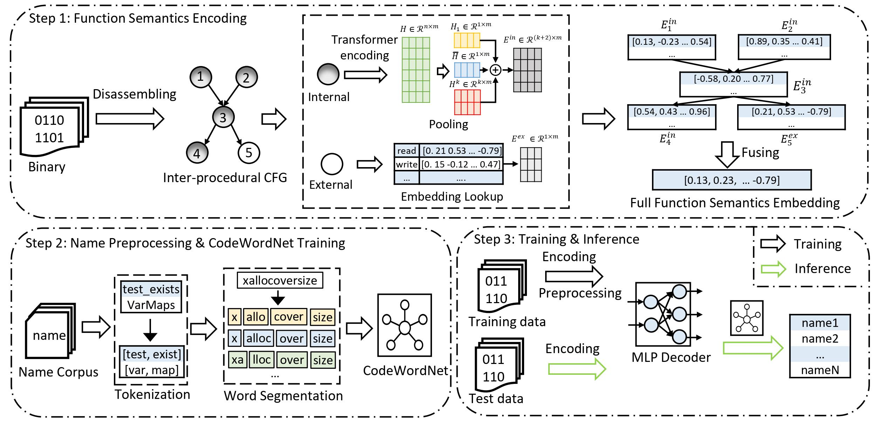

# Eponym

Eponym is a framework for predicting function names in stripped binaries through context-sensitive execution-aware code embeddings. It is a novel neural architecture that learns the comprehensive function semantics by jointly modeling the execution behaviors of the calling context and instructions via a novel fusing encoder. The workflow of Eponym is shown in the image below:

<p align="center"></p>

We implemented Eponym using [Ghidra](https://ghidra-sre.org/) (for binary parsing and ICFG construction), the open source microtrace-based pretrained model from [Trex](https://arxiv.org/abs/2012.08680) (for transformer encoding), [NLTK](https://www.nltk.org/) and [SentencePiece](https://github.com/google/sentencepiece) (for function name preprocessing), and [Gensim](https://radimrehurek.com/gensim/models/word2vec.html) (for CodeWordNet). We built the other components of Eponym with [Pytorch](https://pytorch.org/) and [fairseq](https://github.com/facebookresearch/fairseq). For more details, please refer to our [paper]().

## Table of contents

- [Eponym](#eponym)
  - [Table of contents](#table-of-contents)
  - [Installation](#installation)
    - [Optional Packages](#optional-packages)
  - [Dataset](#dataset)
  - [Usage](#usage)
  - [Citation](#citation)
  - [Troubleshooting](#troubleshooting)

## Installation

To setup the environment, we suggest to use `conda` to install all necessary packages. Conda installation instructions can be found [here](https://docs.conda.io/projects/conda/en/latest/user-guide/install/linux.html). The following setup assumes Conda is installed and is running on Linux system (though Windows should work too).

First, create the conda environment,

`conda create -n eponym python=3.8 numpy scipy scikit-learn`

and activate the conda environment:

`conda activate eponym`

Then, install the latest Pytorch (assume you have GPU and CUDA installed -- check CUDA version by `nvcc -V`. Assume that you have CUDA 11.3 installed. Then you can install pytorch with the following command:

`conda install pytorch torchvision torchaudio cudatoolkit=11.3 -c pytorch -c nvidia`

If CUDA toolkit hasn't been install in your environment, refer to [CUDA toolkit archive](https://developer.nvidia.com/cuda-toolkit-archive) for installation instruction. Then the pytorch installation commands for the specific CUDA version can be found [here](https://pytorch.org/get-started/locally/)).

Next, clone the Eponym and enter and install it via:

```bash
git clone git@github.com:OSUSecLab/Eponym.git
cd Eponym
pip install --editable .
```

Finally, install remaining packages:

`pip install -r requirements.txt`

### Optional Packages

For efficient processing of large datasets, please install PyArrow: 

`pip install pyarrow`

For faster training install NVIDIA's apex library:

``` bash
git clone https://github.com/NVIDIA/apex
cd apex
pip install -v --no-cache-dir --global-option="--cpp_ext" --global-option="--cuda_ext" \
  --global-option="--deprecated_fused_adam" --global-option="--xentropy" \
  --global-option="--fast_multihead_attn" ./
```

## Dataset

We proive a sample `x64` dataset under the [`dataset_generation/dataset_sample`](dataset_generation/dataset_sample) directory and its binarization result under the[`data_bin`](data_bin) directory.

For details on how these datasets are generated from binaries, please refer to the README under [`dataset_generation/`](dataset_generation/).

## Usage


## Citation

If you find Eponym useful, please consider citing our paper:

```plaintex
```

## Troubleshooting

Here is a list of common problems you might encounter while using Eponym.

- [CUDA error](#cuda-error)
- [Apex installation error](#apex-installation-error)